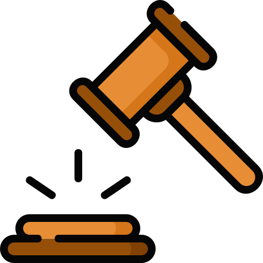

# Ley de Protección de Datos Personales 

- **Objetivo**: Proteger la privacidad y los datos personales de las personas, asegurando un tratamiento adecuado de la información.
- **Ámbito de Aplicación**: Se aplica a organismos públicos y privados que manejan datos personales en Chile.
- **Principios**:
  - **Consentimiento**: Se requiere el permiso del titular para procesar sus datos.
  - **Finalidad**: Los datos deben ser utilizados solo para el propósito para el que fueron recopilados.
  - **Exactitud**: La información debe ser precisa y actualizada.
  - **Seguridad**: Deben implementarse medidas para proteger los datos de accesos no autorizados.
- **Derechos del Titular**: Acceder, rectificar, cancelar y oponerse al tratamiento de sus datos.
- **Sanciones**: Se establecen multas y responsabilidades para quienes infrinjan la ley.

